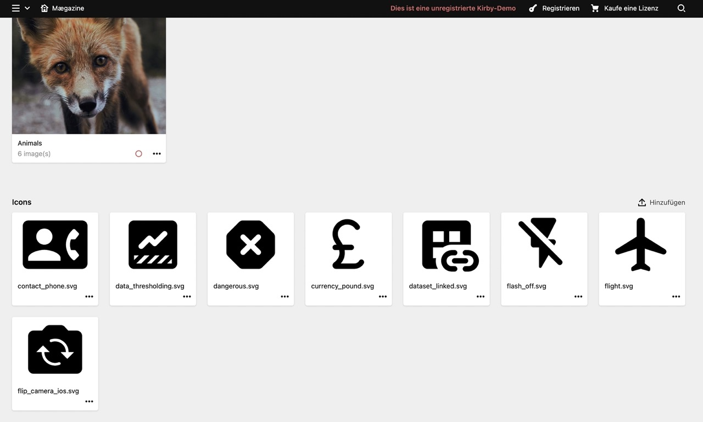

# Kirby3 plugin: Icon sprite



This plugin provides helper functions which can be used in your template to generate a SVG sprite, to reference SVG icons in your templates and to inject SVG icons directly to the template. It also provides blueprints for the fileupload and a files section for your site.yml to manage the icons.
To set custom options, please see the [Options](#options) section in this README file.

> This plugin is completely free and published under the MIT license. However, if you are using it in a commercial project and want to help me keep up with maintenance, please consider [making a donation of your choice](https://www.paypal.me/nerdcel).

## Installation

### Download

Download and copy this repository to `/site/plugins/icon-sprite`.

### Git submodule

```
git submodule add https://github.com/nerdcel/kirby3-icon-sprite.git site/plugins/icon-sprite
```

### Composer

```
composer require nerdcel/kirby3-icon-sprite
```

## Setup

### Template

```php
<?php echo svgSprite();  ?>
<?php echo svgIcon('slug', 'css-classes', [ /** Additional attributes as key => value */]);  ?>
<?php //echo inlineIcon('icon-path or filename', 'css-classes');  ?>
```

### Site.yml

```yml
...
sections:
  svgicons: sections/svgsprite
  label: Override
  ...
```

## Options

The following options are available to be set using your site/config/config.php

```php
'nerdcel.icon-sprite' => [
    'withStyles' => true,
    'fill' => '#0a0a0a',
    'width' => '24px',
    'aspectRatio' => '1'
]
```

## License

MIT

## Credits

- [Marcel Hieke](https://github.com/nerdcel)
